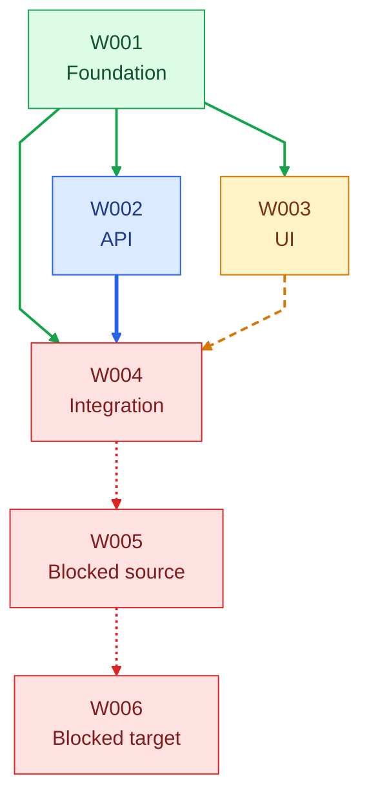

# Work-item dependency graph

> Derived from `../backlog.yaml`. Do not edit this file manually.

## Status

- 🟩 **Completed** — accepted work.
- 🟦 **In Progress** — currently executing.
- 🟨 **Ready** — pending work with all dependencies satisfied.
- 🟥 **Blocked** — pending work with at least one incomplete work-item dependency.

Dependency arrows are authoritative for execution ordering. Flow executes one mutating task at a time; independent read-only research or review may run in parallel.
